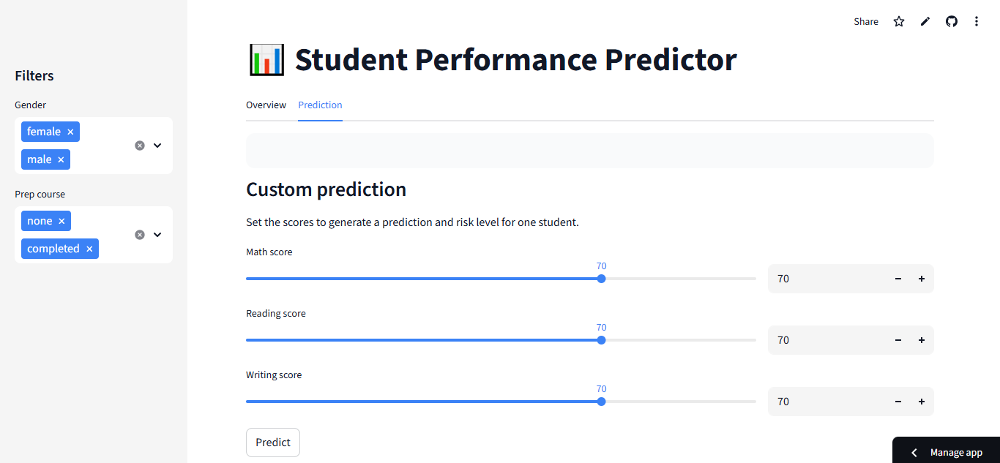

# Student Performance Predictor

## 📊 Live Demo

## 🔗 Links
- GitHub: https://github.com/nazneenahmed11/student-performance-predictor
- Live App: https://student-performance-predictor-w8nvskpwysjbphkdaax6mt.streamlit.app/

## Project Overview
I built a machine learning app that predicts whether a student will pass or fail based on their math, reading, and writing scores, using Logistic Regression and RandomForest, with a Streamlit web app for interaction.

## Overview
- Built a machine learning pipeline on the Kaggle *Students Performance in Exams* dataset.
- Encodes categorical features, trains models, and evaluates using accuracy and cross-validation.
- Includes confusion matrix and coefficient plots to interpret model decisions.

## Dataset
- Source: Kaggle – StudentsPerformance in exams dataset.
- 1000 rows, features like gender, race/ethnicity, parental education, lunch, test preparation, and three exam scores.

## Models 
- Logistic Regression (3 scores) – mean 5‑fold CV accuracy: 1.00.
- RandomForest (default) – mean CV accuracy: 0.988.
- RandomForest (tuned, n_estimators=200, max_depth=10) – mean CV accuracy: 0.989.

## How to Run

pip install -r requirements.txt
streamlit run app.py

- Move sliders for math, reading, and writing (0–100).
- View the average score (green/red based on a 60% rule).
- See the **model** prediction: “Pass ✅ / Fail ❌” from the trained RandomForest model.

## Results
- Very high accuracy on pass/fail prediction.
- Important factors include exam scores and preparation-related features (from coefficient analysis).
- “Winner: Logistic slightly beats RF; deployed model is tuned RF, which performs comparably and is easy to swap.”

## Tech Stack
- Python, Jupyter Notebook, VS Code
- pandas, NumPy
- scikit-learn (Logistic Regression, RandomForestClassifier)
- matplotlib, seaborn
- Git and GitHub for version control
- Streamlit for the web UI.

## Features
- Exploratory data analysis (EDA) on a student performance dataset
- Feature engineering and one-hot encoding for categorical variables
- Two models: Logistic Regression and Random Forest
- 5-fold cross-validation and model comparison between Logistic Regression and Random Forest
- Confusion matrix and coefficient/bar plots for model interpretability

